Nama    : Hafizh Naufal Nuha Kusuma

NIM     : A11.2023.14904

Kelas   : A11.4618

Repo    : https://github.com/hafizh1119/Final_ProjectLMS

# Deskripsi Project

**Simple-LMS** merupakan aplikasi Learning Management System (LMS) berbasis Django yang mendukung proses pembelajaran daring dengan tiga peran pengguna, yaitu Admin, Instructor, dan Student. Aplikasi ini menggunakan Docker Compose sebagai lingkungan deployment, PostgreSQL sebagai database, serta JWT Authentication untuk proses autentikasi pengguna. Sistem menyediakan fitur pengelolaan course, lesson (module & content), enrollment, dan progress belajar, serta dilengkapi dengan pencarian, filter, dan sorting course, review dan wishlist course, curriculum berbasis module dan content dengan perhitungan progress yang lebih akurat, serta student dashboard yang menampilkan ringkasan course aktif, progress pembelajaran, dan rekomendasi course.

## Fitur Dasar yang Sudah Berjalan

* **Docker Compose** – Project dapat dijalankan menggunakan Docker Compose sehingga seluruh layanan dapat dijalankan dalam satu lingkungan container.
* **PostgreSQL & Migration** – Database menggunakan PostgreSQL dan seluruh migration berhasil dijalankan untuk membangun struktur database.
* **JWT Authentication** – Mendukung proses autentikasi menggunakan JSON Web Token (JWT), meliputi registrasi, login, refresh token, serta pengelolaan profil pengguna.
* **Role Management** – Sistem menerapkan tiga peran pengguna, yaitu **Admin**, **Instructor**, dan **Student**, dengan hak akses yang berbeda sesuai fungsinya.
* **Course, Lesson, Enrollment, dan Progress** – Menyediakan endpoint untuk mengelola course, curriculum (module & content), enrollment mahasiswa, serta pelacakan progress pembelajaran.
* **Swagger/OpenAPI** – Seluruh endpoint REST API terdokumentasi dan dapat diuji secara langsung melalui halaman Swagger/OpenAPI.

## Fitur Tambahan yang Dipilih

| No |Fitur                                                                                                                                    | Kategori           | Poin |    Status   |
| -- | ---------------------------------------------------------------------------------------------------------------------------------------- | ------------------ | :--: | :---------: |
| 1  | Search, filter, dan sorting course berdasarkan **keyword, category, instructor, level, status,** dan **sorting**                         | Course Discovery   |  12  | **Selesai** |
| 2  | Rating, review, dan wishlist course sehingga **Student** dapat memberikan review dan menyimpan course favorit                            | Student Engagement |  12  | **Selesai** |
| 3  | Curriculum berbasis **module** dan **content** serta perhitungan **progress belajar** yang lebih akurat berdasarkan penyelesaian content | Learning Progress  |  15  | **Selesai** |
| 4  | Student Dashboard yang menampilkan **ringkasan course aktif**, **progress pembelajaran**, dan **rekomendasi course**                     | Dashboard          |  12  | **Selesai** |

## Penjelasan Implementasi

### 1. Search, Filter, dan Sorting Course

Fitur ini memungkinkan pengguna mencari course berdasarkan **keyword**, serta melakukan filter berdasarkan **category**, **instructor**, **level**, dan **status**. Selain itu, sistem menyediakan fitur sorting untuk memudahkan pengguna menemukan course sesuai kebutuhan.

### 2. Rating, Review, dan Wishlist Course

Fitur ini memungkinkan **Student** memberikan **rating** dan **review** terhadap course yang telah diikuti, serta menyimpan course ke dalam **wishlist** sebagai daftar course favorit yang dapat diakses kembali.

Sistem rating menggunakan skala **1–5** dengan ketentuan sebagai berikut:

* **1** = Sangat Buruk
* **2** = Buruk
* **3** = Cukup
* **4** = Baik
* **5** = Sangat Baik

Setiap **Student** hanya dapat memberikan **satu review** untuk setiap course yang telah diikuti, sehingga setiap course hanya memiliki satu penilaian dari setiap mahasiswa. Selain itu, fitur **wishlist** memungkinkan Student menyimpan course favorit untuk memudahkan pencarian dan akses kembali di kemudian hari.

### 3. Curriculum dan Progress Belajar

Setiap **course** memiliki struktur **module** dan **content** sebagai curriculum pembelajaran. Progress belajar dihitung berdasarkan jumlah **content** yang telah diselesaikan oleh mahasiswa dibandingkan dengan total content pada course, sehingga persentase progress menjadi lebih akurat.

### 4. Student Dashboard

Dashboard mahasiswa menampilkan informasi ringkas mengenai **jumlah course aktif**, **progress pembelajaran pada setiap course**, serta **rekomendasi course** yang dapat diikuti, sehingga mahasiswa dapat memantau aktivitas belajarnya dengan lebih mudah.

## Cara Menjalankan Project

### 1. Clone Repository

Clone repository ke komputer lokal.

```bash
git clone https://github.com/hafizh1119/Final_ProjectLMS
cd Final_ProjectLMS
```

---

### 2. Jalankan Docker Compose

Build image Docker dan jalankan seluruh service.

```bash
docker compose up --build -d
```

Pastikan seluruh container berhasil berjalan.

```bash
docker ps
```

---

### 3. Jalankan Database Migration

Masuk ke container aplikasi kemudian jalankan migration.

```bash
docker exec -it lms-app python manage.py migrate
```

Migration akan membuat seluruh tabel yang diperlukan pada database PostgreSQL.

---

### 4. Menjalankan Seeder

Isi database dengan data awal (teacher, student, category, course, module, content, enrollment, review, wishlist, dan progress).

```bash
docker exec -it lms-app python manage.py seed_data
```

Seeder akan membuat data dummy sehingga seluruh fitur dapat langsung diuji melalui API.

---

### 5. Akses Swagger/OpenAPI

Setelah seluruh proses selesai, dokumentasi API dapat diakses melalui browser.

```
http://localhost:8000/api/docs
```

Seluruh endpoint REST API dapat langsung diuji melalui halaman Swagger/OpenAPI.

---

### 6. Login Menggunakan Akun Seeder

Gunakan salah satu akun yang dibuat oleh seeder atau akun superuser untuk mencoba seluruh fitur sesuai hak akses **Admin**, **Instructor**, maupun **Student**.

## Akun Demo

Seeder akan membuat akun demo dengan kredensial berikut.

| Role       | Username                                                             | Password                                               |
| ---------- | -------------------------------------------------------------------- | ------------------------------------------------------ |
| Admin      | `admin1` - `admin5`                                                  | `password123`                                          |
| Instructor | `dosen01` – `dosen20`                                                | `password123`                                          |
| Student    | `mhs001` – `mhs080`                                                  | `password123`                                          |


## Endpoint Penting

Berikut merupakan endpoint utama yang digunakan untuk menguji seluruh fitur pada project **Simple-LMS**.

### Authentication

| Method | Endpoint             | Deskripsi                                                   |
| ------ | -------------------- | ----------------------------------------------------------- |
| POST   | `/api/auth/register` | Registrasi pengguna baru.                                   |
| POST   | `/api/auth/login`    | Login dan mendapatkan JWT Access Token serta Refresh Token. |
| GET    | `/api/auth/me`       | Menampilkan informasi pengguna yang sedang login.           |

---

### Course

| Method | Endpoint            | Deskripsi                                                            |
| ------ | ------------------- | -------------------------------------------------------------------- |
| GET    | `/api/courses`      | Menampilkan daftar course beserta fitur search, filter, dan sorting. |
| POST   | `/api/courses`      | Menambahkan course baru.                                             |
| GET    | `/api/courses/{id}` | Menampilkan detail course.                                           |

---

### Curriculum (Module & Content)

| Method | Endpoint       | Deskripsi                                                    |
| ------ | -------------- | ------------------------------------------------------------ |
| GET    | `/api/modules` | Menampilkan curriculum course berupa module beserta content. |
| POST   | `/api/modules` | Menambahkan module pada course.                              |

---

### Enrollment

| Method | Endpoint                      | Deskripsi                                                  |
| ------ | ----------------------------- | ---------------------------------------------------------- |
| POST   | `/api/enrollments`            | Melakukan enrollment (mendaftar) ke course.                |
| GET    | `/api/enrollments/my-courses` | Menampilkan daftar course yang telah diikuti oleh student. |

---

### Progress

| Method | Endpoint                         | Deskripsi                                       |
| ------ | -------------------------------- | ----------------------------------------------- |
| POST   | `/api/enrollments/{id}/progress` | Menandai content sebagai selesai dipelajari.    |
| GET    | `/api/courses/{id}/progress`     | Menampilkan progress belajar pada suatu course. |

---

### Review

| Method | Endpoint                    | Deskripsi                                 |
| ------ | --------------------------- | ----------------------------------------- |
| POST   | `/api/courses/{id}/reviews` | Memberikan rating dan review pada course. |
| GET    | `/api/courses/{id}/reviews` | Menampilkan daftar review suatu course.   |

---

### Wishlist

| Method | Endpoint                     | Deskripsi                                     |
| ------ | ---------------------------- | --------------------------------------------- |
| POST   | `/api/courses/{id}/wishlist` | Menambahkan course ke wishlist.               |
| DELETE | `/api/courses/{id}/wishlist` | Menghapus course dari wishlist.               |
| GET    | `/api/wishlist`              | Menampilkan daftar course favorit (wishlist). |

---

### Dashboard

| Method | Endpoint         | Deskripsi                                                                          |
| ------ | ---------------- | ---------------------------------------------------------------------------------- |
| GET    | `/api/dashboard` | Menampilkan ringkasan course aktif, progress pembelajaran, dan rekomendasi course. |

# Bukti Pengujian

## 1. Docker Compose

Menjalankan seluruh service menggunakan Docker Compose.

```bash
docker compose up --build -d
```

**Hasil Docker Compose**

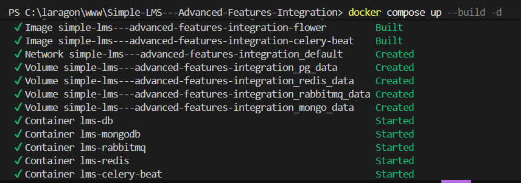

Memastikan seluruh container berhasil berjalan.

```bash
docker ps
```

**Hasil Docker PS**

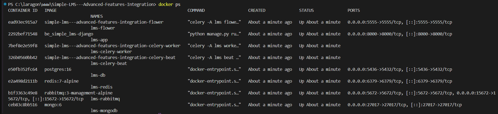

---

## 2. Database Migration

Melakukan migrasi database PostgreSQL.

```bash
docker exec -it lms-app python manage.py migrate
```

**Hasil Migration**

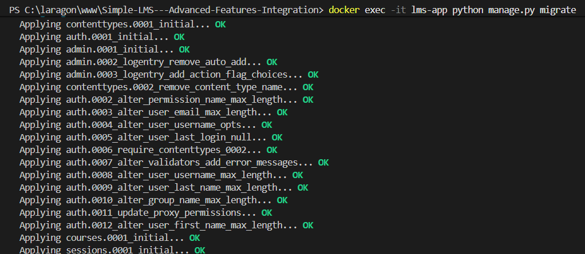

---

## 3. Membuat Superuser

Membuat akun administrator untuk mengakses Django Admin.

```bash
docker exec -it lms-app python manage.py createsuperuser
```

**Hasil Pembuatan Superuser**

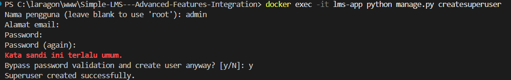

---

## 4. Seeder

Mengisi database dengan data awal (dummy data).

```bash
docker exec -it lms-app python manage.py seed_data
```

**Hasil Seeder**

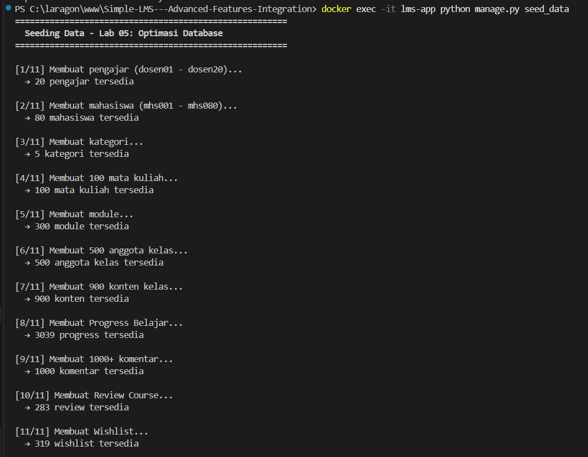

---

## 5. Authentication JWT

### Register

Endpoint:

```http
POST /api/auth/register
```

**Hasil Register**

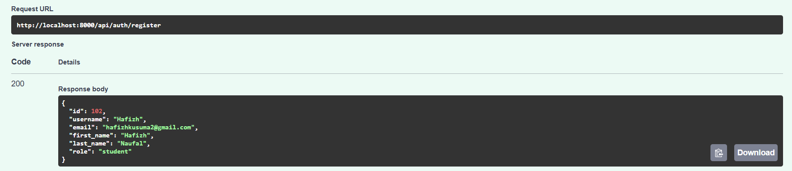

---

### Login

Endpoint:

```http
POST /api/auth/login
```

**Hasil Login**

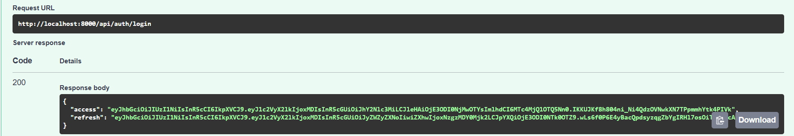

---

### Refresh Token

Endpoint:

```http
POST /api/auth/refresh
```

**Hasil Refresh Token**

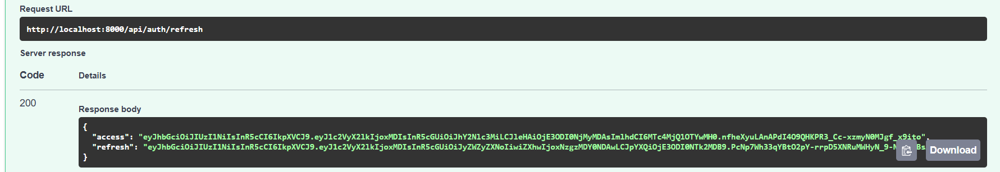

---

### Get Profile (Me)

Endpoint:

```http
GET /api/auth/me
```

**Hasil Endpoint Me**

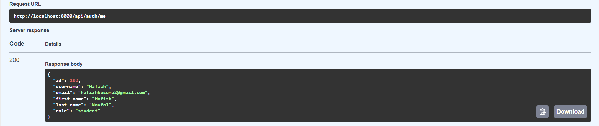

## 6. Role-Based Access Control (RBAC)

Project menerapkan **Role-Based Access Control (RBAC)** dengan tiga peran pengguna, yaitu **Admin**, **Instructor**, dan **Student**. Setiap role hanya dapat mengakses endpoint sesuai hak akses yang telah ditentukan.

### 6.1 Admin

Admin memiliki hak akses terhadap endpoint administrasi.

**Endpoint**

```http
POST /api/admin/update-stats
```

**Hasil**

Admin berhasil mengakses endpoint administrasi dan sistem mengembalikan respons bahwa proses pembaruan statistik telah dimasukkan ke dalam antrean (queue).

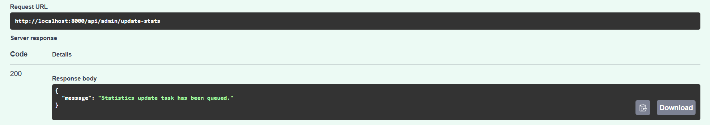

---

### 6.2 Instructor

Instructor memiliki hak untuk membuat course.

**Hasil Berhasil**

Instructor berhasil membuat course baru.

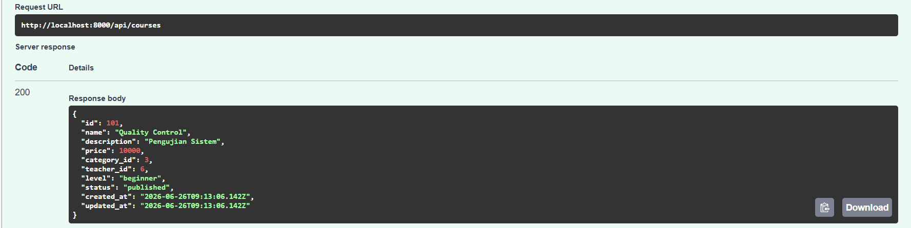

**Hasil Ditolak**

Ketika Instructor mencoba mengakses endpoint yang hanya diperuntukkan bagi Admin, sistem mengembalikan **403 Forbidden** dengan pesan **"Admin only"**.

**Endpoint**

```http
POST /api/admin/update-stats
```

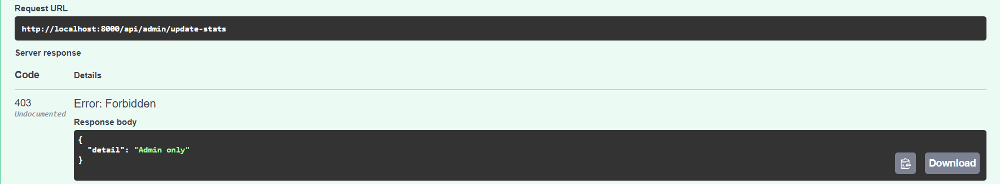

---

### 6.3 Student

Student dapat mengakses fitur pembelajaran miliknya, seperti daftar course yang telah diikuti.

**Endpoint**

```http
GET /api/enrollments/my-courses
```

**Hasil Berhasil**

Student berhasil melihat daftar course yang telah diikuti.

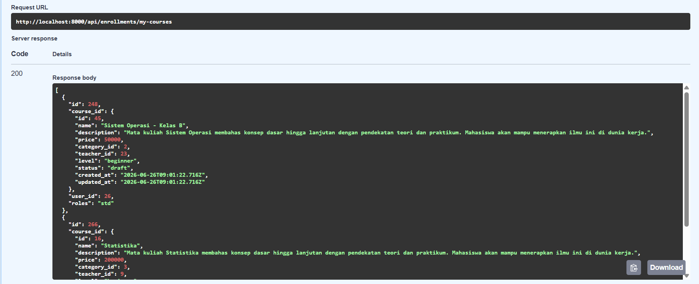

**Hasil Ditolak**

Student tidak diperbolehkan membuat course. Ketika mencoba mengakses endpoint khusus Instructor, sistem mengembalikan **403 Forbidden** dengan pesan **"Instructor only"**.

**Endpoint**

```http
POST /api/courses
```

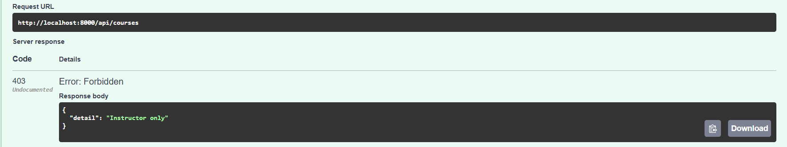

Response:

```json
{
    "detail": "Instructor only"
}
```

---

## 7. Endpoint Course

### 7.1 Menampilkan Daftar Course

**Endpoint**

```http
GET /api/courses/list
```

**Hasil**

Berhasil menampilkan daftar course yang tersedia pada sistem.

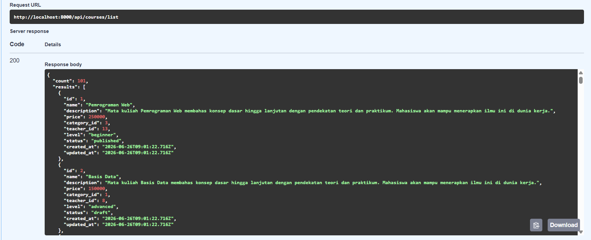

---

### 7.2 Menampilkan Detail Course

**Endpoint**

```http
GET /api/courses/{id}
```

**Hasil**

Berhasil menampilkan informasi detail dari course yang dipilih.

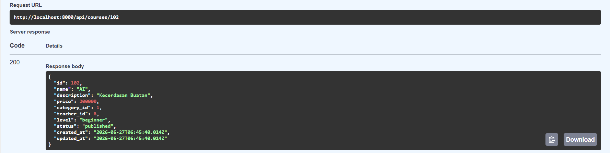

---

### 7.3 Membuat Course

**Endpoint**

```http
POST /api/courses
```

**Hasil**

Instructor berhasil membuat course baru.

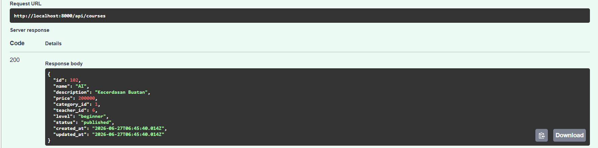

---

## 8. Endpoint Lesson

### 8.1 Menampilkan Daftar Lesson

**Endpoint**

```http
GET /api/lessons
```

**Hasil**

Berhasil menampilkan seluruh lesson beserta module dan course yang dimiliki.

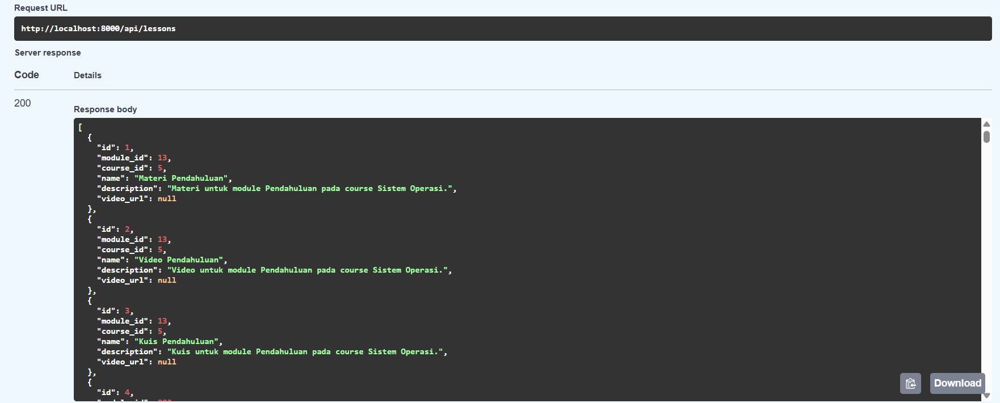

---

### 8.2 Menambahkan Lesson

**Endpoint**

```http
POST /api/lessons
```

**Hasil**

Instructor berhasil menambahkan lesson baru ke dalam module yang dipilih.

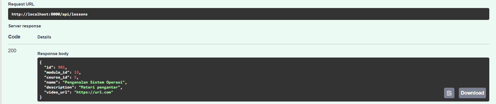

---

## 9. Endpoint Enrollment

### 9.1 Enrollment Course

**Endpoint**

```http
POST /api/enrollments
```

**Hasil**

Mahasiswa berhasil melakukan enrollment ke dalam course yang dipilih.

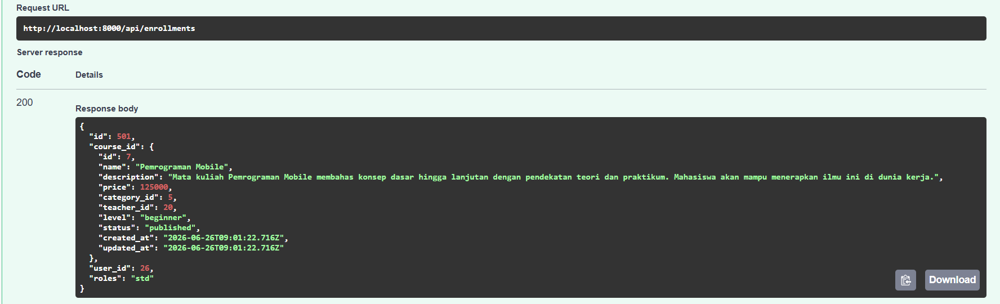

---

### 9.2 My Courses

**Endpoint**

```http
GET /api/enrollments/my-courses
```

**Hasil**

Berhasil menampilkan daftar course yang telah diikuti oleh mahasiswa.

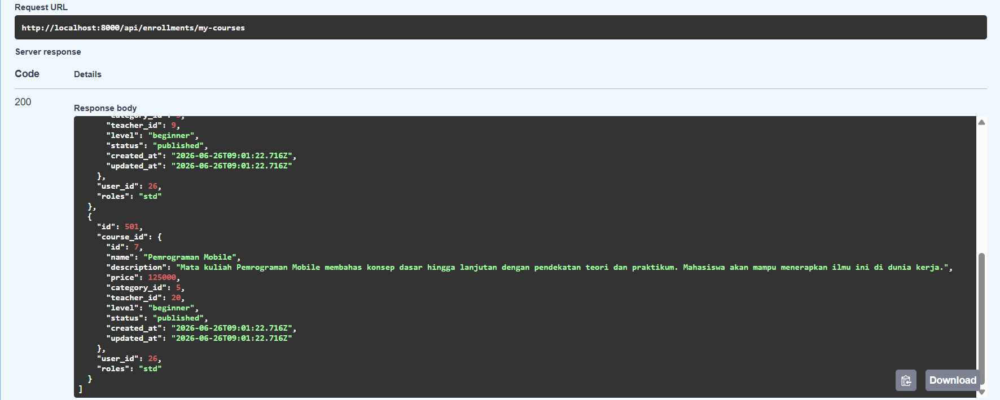

---

## 10. Endpoint Progress

### 10.1 Menandai Progress Lesson

**Endpoint**

```http
POST /api/enrollments/{id}/progress
```

**Hasil**

Progress lesson berhasil disimpan sebagai materi yang telah diselesaikan oleh mahasiswa.

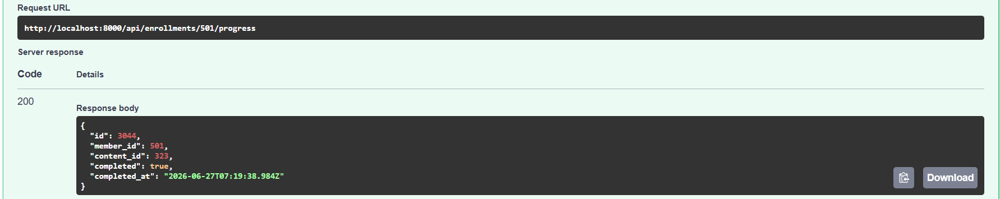

---

### 10.2 Melihat Progress Course

**Endpoint**

```http
GET /api/courses/{id}/progress
```

**Hasil**

Berhasil menampilkan jumlah lesson yang telah diselesaikan beserta persentase progress belajar pada course.

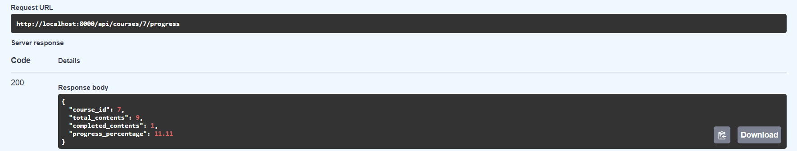

# 11. Search, Filter, dan Sorting Course

Fitur ini memungkinkan pengguna mencari course berdasarkan kata kunci serta melakukan filter berdasarkan kategori, instructor, level, status, dan sorting sehingga course lebih mudah ditemukan.

Fitur pencarian (**search**) digunakan untuk menemukan course berdasarkan kata kunci (keyword) yang dimasukkan pengguna, seperti nama course atau informasi yang berkaitan dengan course. Dengan fitur ini, pengguna tidak perlu menelusuri seluruh daftar course secara manual untuk menemukan course yang diinginkan.

Selain pencarian, sistem juga menyediakan fitur **filter** yang memungkinkan pengguna menyaring daftar course berdasarkan beberapa kriteria, yaitu **kategori (category)**, **instruktur (instructor)**, **level pembelajaran (level)**, dan **status course (status)**. Pengguna dapat menggunakan satu atau beberapa filter secara bersamaan sehingga hasil pencarian menjadi lebih spesifik sesuai kebutuhan.

Selanjutnya, fitur **sorting** digunakan untuk mengurutkan daftar course berdasarkan atribut tertentu, seperti harga atau waktu pembuatan course. Dengan demikian, pengguna dapat melihat daftar course sesuai urutan yang diinginkan tanpa harus melakukan pencarian secara manual.

Kombinasi antara fitur search, filter, dan sorting membuat proses pencarian course menjadi lebih cepat, fleksibel, dan efisien, terutama ketika jumlah course pada sistem semakin banyak.

### 11.1 Search Course

**Endpoint**

```http
GET /api/courses?search=Pemrograman
```

**Hasil**

Berhasil menampilkan course yang sesuai dengan kata kunci pencarian.


---

### 11.2 Filter Course

**Endpoint**

```http
GET /api/courses?category=5&teacher=20&level=beginner&status=published
```

**Hasil**

Berhasil menampilkan course sesuai kategori, instructor, level, dan status yang dipilih.

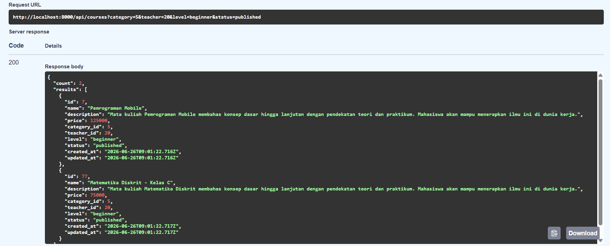

---

### 11.3 Sorting Course

**Endpoint**

```http
GET /api/courses?sort=price
```

**Hasil**

Berhasil mengurutkan daftar course sesuai parameter sorting.

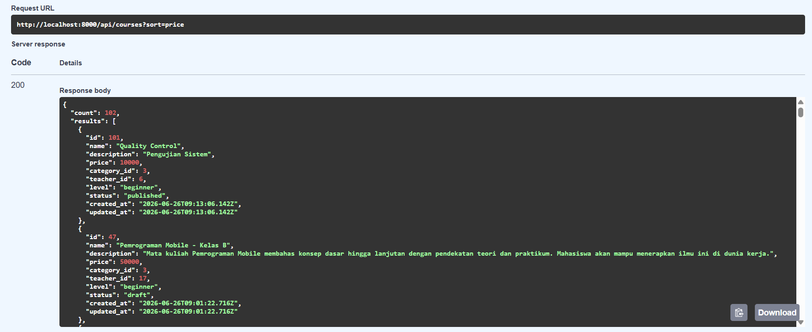

# 12. Rating, Review, dan Wishlist Course

Fitur ini memungkinkan mahasiswa memberikan penilaian terhadap course yang telah diikuti serta menyimpan course ke dalam daftar wishlist.

Fitur **Rating dan Review** digunakan untuk memberikan umpan balik terhadap course yang telah dipelajari oleh mahasiswa. Setiap mahasiswa dapat memberikan **rating** dengan skala **1 hingga 5**, di mana nilai yang lebih tinggi menunjukkan tingkat kepuasan yang lebih baik terhadap course. Selain memberikan rating, mahasiswa juga dapat menuliskan **review** berupa komentar atau pengalaman selama mengikuti course. Informasi tersebut dapat membantu instructor dalam melakukan evaluasi dan peningkatan kualitas materi pembelajaran, serta menjadi referensi bagi mahasiswa lain sebelum mengikuti course yang sama.

Selain fitur penilaian, sistem juga menyediakan fitur **Wishlist** yang memungkinkan mahasiswa menyimpan course yang ingin dipelajari pada kemudian hari. Dengan adanya wishlist, mahasiswa dapat mengelompokkan course yang diminati tanpa harus langsung melakukan enrollment. Daftar wishlist dapat dilihat kembali kapan saja dan course yang sudah tidak diperlukan dapat dihapus dari daftar tersebut.

Kombinasi fitur Rating, Review, dan Wishlist memberikan pengalaman belajar yang lebih interaktif. Mahasiswa dapat memberikan masukan terhadap course yang telah diikuti sekaligus menyimpan course favorit sebagai referensi untuk pembelajaran berikutnya.

### 12.1 Memberikan Rating dan Review

**Endpoint**

```http
POST /api/courses/{id}/reviews
```

**Hasil**

Mahasiswa berhasil memberikan rating dan review terhadap course.

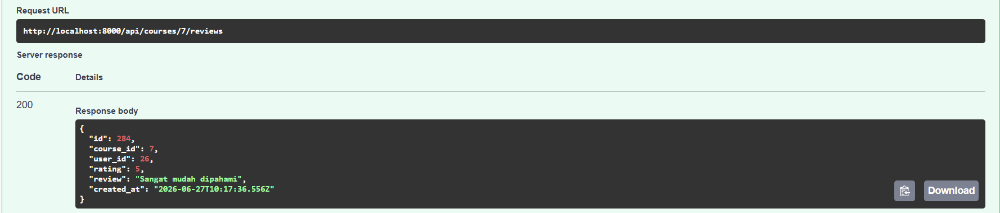

---

### 12.2 Melihat Review Course

**Endpoint**

```http
GET /api/courses/{id}/reviews
```

**Hasil**

Berhasil menampilkan daftar rating dan review dari mahasiswa.

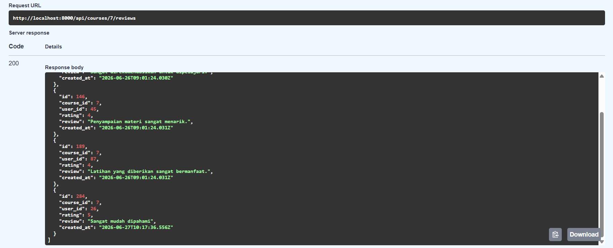

---

### 12.3 Menambahkan Wishlist

**Endpoint**

```http
POST /api/courses/{id}/wishlist
```

**Hasil**

Course berhasil ditambahkan ke wishlist.

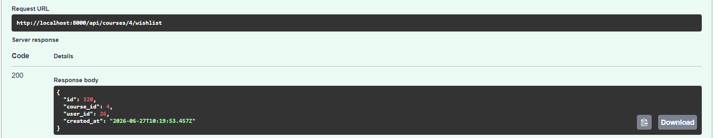

---

### 12.4 Melihat Wishlist

**Endpoint**

```http
GET /api/wishlist
```

**Hasil**

Berhasil menampilkan daftar course yang telah disimpan ke wishlist.

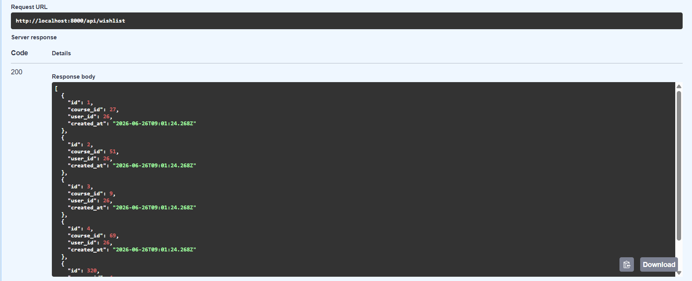

---

### 12.5 Menghapus Wishlist

**Endpoint**

```http
DELETE /api/courses/{id}/wishlist
```

**Hasil**

Course berhasil dihapus dari wishlist.

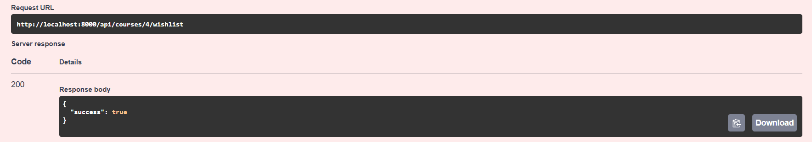

# 13. Curriculum dan Progress Belajar Detail

Fitur ini mengelompokkan lesson ke dalam beberapa module sehingga struktur pembelajaran menjadi lebih teratur dan progress belajar dapat dihitung berdasarkan lesson yang telah diselesaikan.

### 13.1 Struktur Curriculum

Pada project ini, curriculum pembelajaran disusun menggunakan dua entitas utama, yaitu **Module** dan **Lesson**.

* **Module** digunakan sebagai pengelompokan materi pembelajaran (section) dalam suatu course. Setiap course dapat memiliki lebih dari satu module yang disusun berdasarkan urutan pembelajaran menggunakan atribut **order**, sehingga materi dipelajari secara bertahap mulai dari dasar hingga lanjutan.
* **Lesson** merupakan isi dari setiap module yang berisi materi pembelajaran, seperti materi, video, maupun kuis. Setiap lesson selalu terhubung dengan satu module melalui atribut **module_id**, sehingga setiap lesson hanya dimiliki oleh satu module.

Hubungan antara Course, Module, dan Lesson dapat digambarkan sebagai berikut.

```text
Course
│
├── Module 1 (Order = 1)
│   ├── Lesson 1
│   ├── Lesson 2
│   └── Lesson 3
│
├── Module 2 (Order = 2)
│   ├── Lesson 1
│   ├── Lesson 2
│   └── Lesson 3
│
└── Module 3 (Order = 3)
    ├── Lesson 1
    └── Lesson 2
```

Struktur tersebut membuat materi pembelajaran lebih terorganisir karena setiap module memiliki kumpulan lesson yang saling berkaitan. Selain mempermudah penyusunan curriculum, struktur ini juga menjadi dasar dalam perhitungan progress belajar mahasiswa.

Progress belajar dihitung berdasarkan jumlah lesson yang telah diselesaikan oleh mahasiswa. Setiap kali mahasiswa menyelesaikan sebuah lesson, sistem akan menyimpan data pada tabel **CourseContentCompletion**. Selanjutnya, sistem membandingkan jumlah lesson yang telah diselesaikan dengan total lesson yang dimiliki oleh course untuk menghasilkan persentase progress belajar.

Perhitungan progress dilakukan menggunakan rumus berikut.

**Progress (%) = (Jumlah Lesson Selesai ÷ Total Lesson pada Course) × 100%**

Sebagai contoh, apabila sebuah course memiliki **9 lesson** dan mahasiswa telah menyelesaikan **3 lesson**, maka progress belajar yang ditampilkan adalah:

**Progress = (3 ÷ 9) × 100% = 33,33%**

Dengan mekanisme tersebut, progress belajar menjadi lebih akurat karena dihitung berdasarkan lesson yang benar-benar telah diselesaikan oleh mahasiswa, bukan hanya berdasarkan status course secara keseluruhan.

### 13.2 Menambahkan Module

**Endpoint**

```http
POST /api/modules
```

**Hasil**

Instructor berhasil menambahkan module pada course.

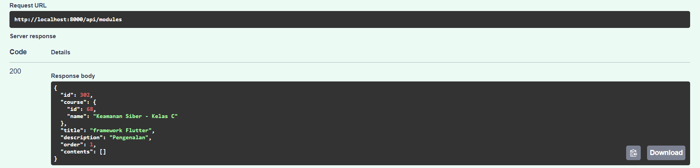

---

### 13.3 Menampilkan Module

**Endpoint**

```http
GET /api/modules
```

**Hasil**

Berhasil menampilkan module beserta lesson yang dimiliki.

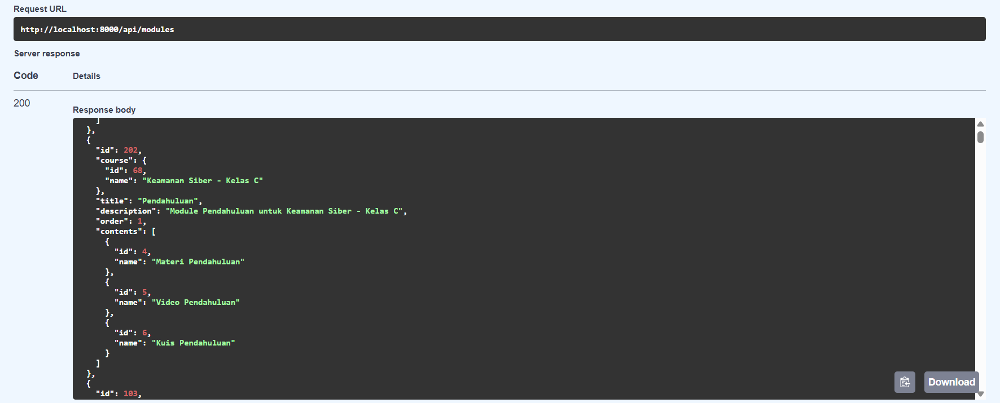

# 14. Student Dashboard

Student Dashboard menampilkan ringkasan pembelajaran mahasiswa yang terdiri dari jumlah course aktif, progress belajar, serta rekomendasi course.

### 14.1 Dashboard Mahasiswa

**Endpoint**

```http
GET /api/dashboard
```

**Hasil**

Berhasil menampilkan jumlah course aktif, progress pembelajaran, dan rekomendasi course.

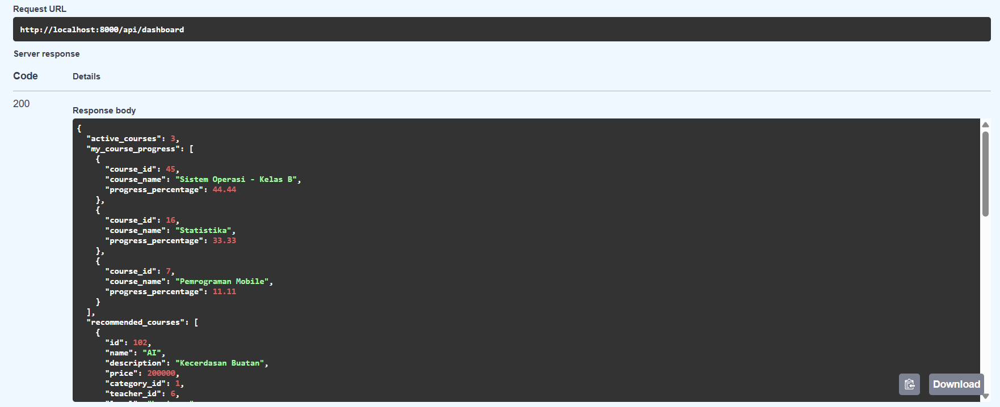
